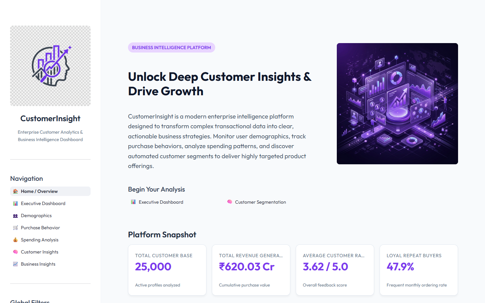
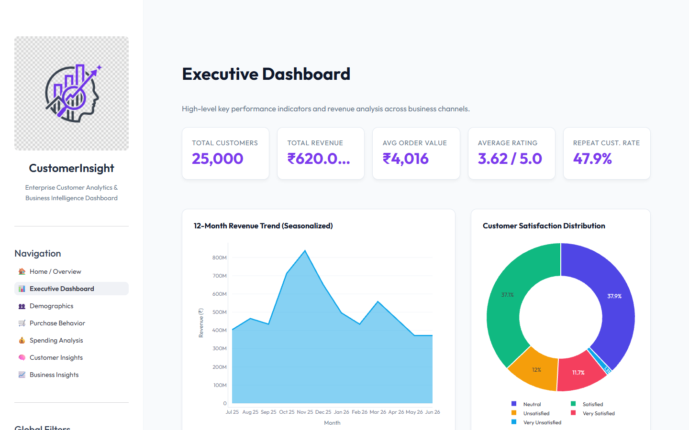
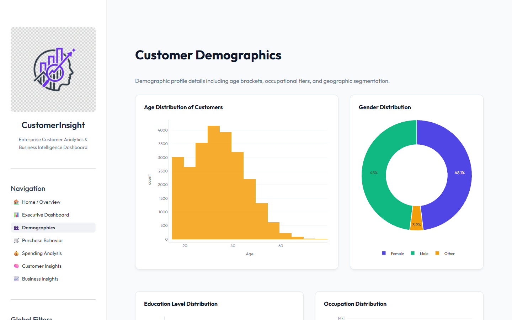
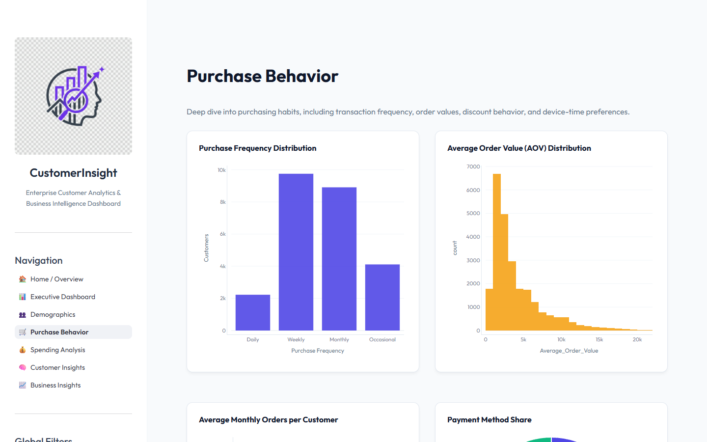
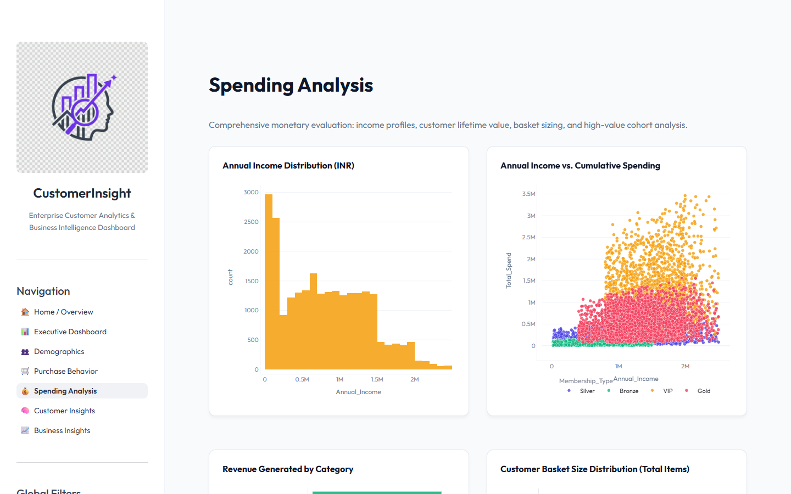
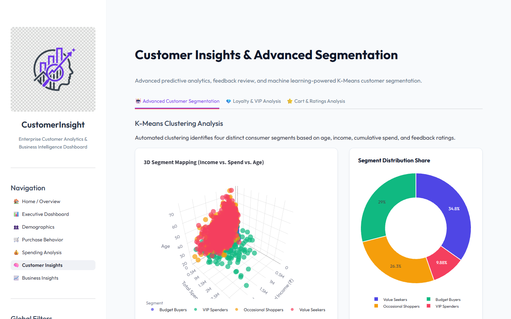
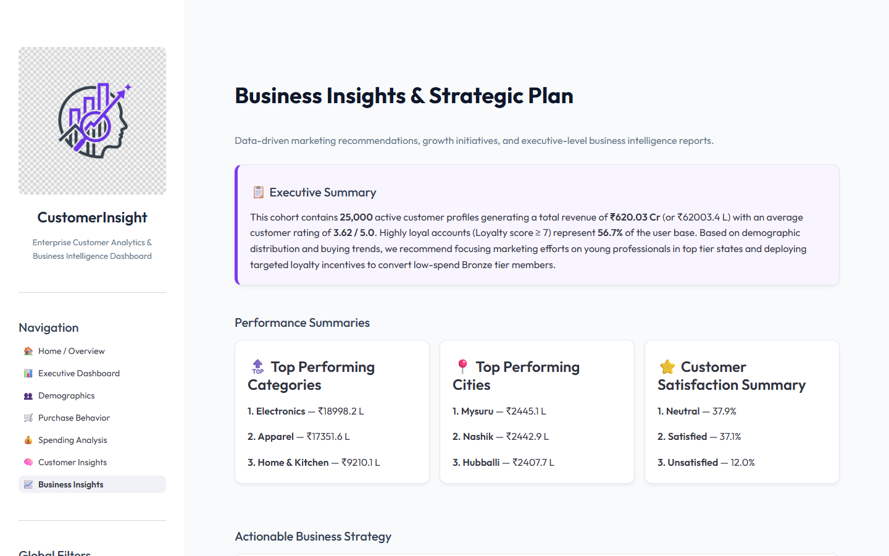

<p align="center">


</p>

# CustomerInsight 📊

**CustomerInsight** is a production-ready, enterprise-grade business intelligence and customer analytics dashboard built on top of **Streamlit**, **Pandas**, **Plotly**, and **Scikit-learn**. The platform processes e-commerce customer transaction histories and demographic data to generate deep, multi-dimensional business insights, performance evaluations, and automated customer segmentations.

---

## 🚀 Key Features

- **🏠 Interactive Landing Page:** A modern homepage with an overview of the platform, high-level snapshot metrics (cumulative revenue, active count, average ratings), and deep-linking navigation cards.
- **📊 Executive Dashboard:** A corporate overview containing core KPIs, a seasonalized revenue trend area chart, customer satisfaction distribution, state breakdowns, and category sales share.
- **👥 Demographics Analysis:** Explores client distributions across ages, genders, occupational categories, educational standings, and membership tiers. Features a nested, hierarchical Treemap visualization for State/City locations.
- **🛒 Purchase Behavior Analysis:** Investigates order frequency spreads, payment preference slices, monthly transaction buckets, discount responsiveness, and purchase trends by device type and time of day.
- **💰 Spending Insights:** Evaluates income spreads, income-to-spend correlations, category-wise revenue shares, average basket sizing, and filters profiles for High-Value Spenders (HVCs) contributing to the top 10% revenue segment.
- **🧠 Customer Insights & Analysis:** Incorporates a real-time **K-Means Clustering** engine to group users into segments: *VIP Spenders*, *Value Seekers*, *Occasional Shoppers*, and *Budget Buyers*. Displays segment attributes in a fluid, interactive 3D scatter plot alongside custom client personas.
- **📈 Strategic Recommendations:** Highlights top categories, top cities, and compiles targeted quarterly growth initiatives, marketing takeovers, and digital payment updates, featuring a direct download for the strategic brief.

---

## 📸 Screenshots

### 1. Home / Landing Page


### 2. Executive Dashboard


### 3. Customer Demographics


### 4. Purchase Behavior


### 5. Spending Analysis


### 6. Customer Insights & Segmentation


### 7. Strategic Business Insights


---

## 🛠️ Tech Stack

- **Core Framework:** Streamlit
- **Data Engineering:** Pandas, NumPy
- **Visualizations:** Plotly Express, Plotly Graph Objects
- **Machine Learning:** Scikit-learn (K-Means Clustering, StandardScaler)
- **UI Customizations:** Custom CSS, Native Keyed Containers

---

## 📁 Folder Structure

```text
CustomerInsight/
│── app.py                   # Main entrypoint & Home Page
│── requirements.txt         # Python dependencies
│── runtime.txt              # Specifies Python runtime version
│── render.yaml              # Render deployment configuration
│── README.md                # Platform documentation
│
├── assets/
│   ├── logo.png             # Platform brand logo
│   ├── hero.png             # Landing page hero graphics
│   ├── style.css            # Custom CSS styles (hiding default branding, styling cards)
│   └── screenshots/         # Verified platform screenshots
│
├── data/
│   └── customer_data.csv    # Synthesized customer purchase behavior dataset
│
├── pages/
│   ├── 1_Executive_Dashboard.py   # High-level business overview
│   ├── 2_Customer_Demographics.py # Demographic profiling
│   ├── 3_Purchase_Behavior.py     # Shopping trends
│   ├── 4_Spending_Analysis.py     # Monetary evaluations & HVC profiles
│   ├── 5_Customer_Insights.py     # Customer Insights & Segmentation definitions
│   └── 6_Business_Insights.py     # Strategic management roadmaps
│
└── utils/
    ├── charts.py            # Styled Plotly plotting utilities
    ├── data_loader.py       # Cached dataframe manager
    └── data_generator.py    # Synthetic customer behavior data generator
```

---

## 💻 Installation & Setup

1. **Clone the repository:**
   ```bash
   git clone https://github.com/your-username/CustomerInsight.git
   cd CustomerInsight
   ```

2. **Install dependencies:**
   ```bash
   pip install -r requirements.txt
   ```

3. **Generate Dataset (Optional):**
   *Note: The platform data loader will automatically run the generator on its first launch if the dataset is missing. To generate it manually:*
   ```bash
   python utils/data_generator.py
   ```

4. **Launch the application:**
   ```bash
   streamlit run app.py
   ```

---

## ☁️ Deployment Guide

### Deploying to Render
1. Connect your Github Repository to **Render**.
2. Select **Web Service**.
3. Choose the Environment as **Python**.
4. Set the **Build Command**:
   ```bash
   pip install -r requirements.txt && python utils/data_generator.py
   ```
5. Set the **Start Command**:
   ```bash
   streamlit run app.py --server.port $PORT
   ```
6. Add the following Environment Variable:
   - `PYTHON_VERSION`: `3.10.12`

### Deploying to Streamlit Community Cloud
1. Push your code to a public GitHub repository.
2. Sign in to [Streamlit Community Cloud](https://share.streamlit.io/).
3. Click **New app**, select your repository, branch, and set the main file path to `app.py`.
4. Click **Deploy**.

---

## 📄 License
This project is licensed under the MIT License. See the LICENSE file for details.

---

## 👥 Developer
**Milan Kumar**
AI&ML Enthusiast

